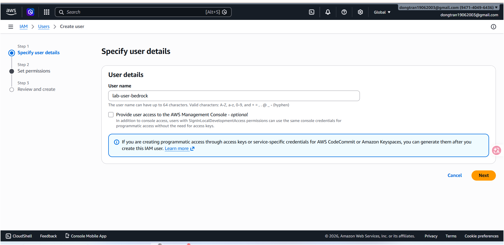
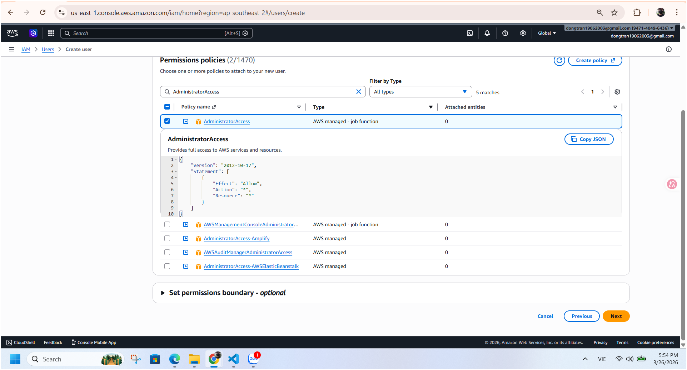
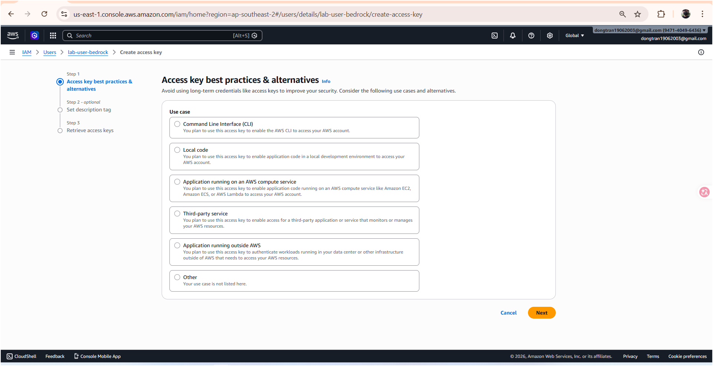

# Lab 1 - Ghi chú triển khai (Tiếng Việt)

## Tham chiếu workshop gốc

- Workshop: https://catalog.workshops.aws/workshops/850fcd5c-fd1f-48d7-932c-ad9babede979/en-US
- Lab 1: https://catalog.workshops.aws/workshops/850fcd5c-fd1f-48d7-932c-ad9babede979/en-US/20-create-an-agent

## Mục tiêu của bản triển khai này

- Làm theo luồng Lab 1 của workshop.
- Tùy biến code để tập trung vào hành vi gọi tool.
- Ghi lại quy trình, ảnh minh họa và kết quả chạy để làm evidence.

## Tóm tắt phần code đã tùy biến

- File chạy chính: `index.py`
- Agent sử dụng Strands + BedrockModel.
- Tools đã định nghĩa bằng `@tool`:
	- `add(a, b)`
	- `subtract(a, b)`
	- `multiply(a, b)`
	- `divide(a, b)`
- System prompt yêu cầu agent trả lời bằng tiếng Việt và ưu tiên dùng tool.

## Bước 1 - Chuẩn bị IAM user để dùng local

Ảnh minh họa quá trình tạo user và access key:





Gợi ý policy theo hướng tối thiểu quyền (không khuyến khích full quyền):

| Service | Policy gợi ý | Ý nghĩa |
| --- | --- | --- |
| Bedrock | `AmazonBedrockFullAccess` | Gọi API Bedrock |
| CloudFormation | `AWSCloudFormationFullAccess` | Tạo/update stack (nếu cần theo lab) |
| S3 | `AmazonS3FullAccess` hoặc policy giới hạn bucket | Đọc/ghi dữ liệu S3 (nếu dùng) |
| CloudWatch Logs | `CloudWatchLogsFullAccess` | Ghi/đọc log |

## Bước 2 - Cài môi trường và chạy Lab 1

```powershell
python -m venv .venv
.\.venv\Scripts\Activate.ps1
pip install -r requirements.txt
python index.py
```

## Cách hoạt động của agent

- Agent nhận câu hỏi người dùng.
- Agent chọn tool phù hợp theo ngữ nghĩa bài toán.
- Strands tự tạo schema tool từ hàm được gắn `@tool` và đưa vào ngữ cảnh hệ thống.
- Agent trả kết quả cuối cùng dựa trên output của tool.

## Hạn chế hiện tại (đúng tinh thần Lab 1)

- Chưa có memory dài hạn.
- Chưa có gateway tool dùng chung.
- Chưa có observability production.
- Chưa có identity theo user.
- Chạy local, chưa scale runtime.

