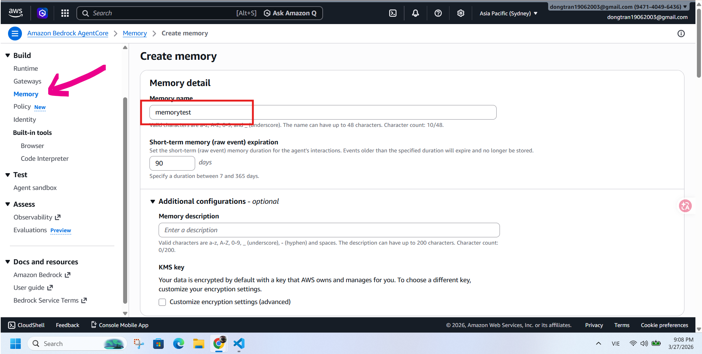
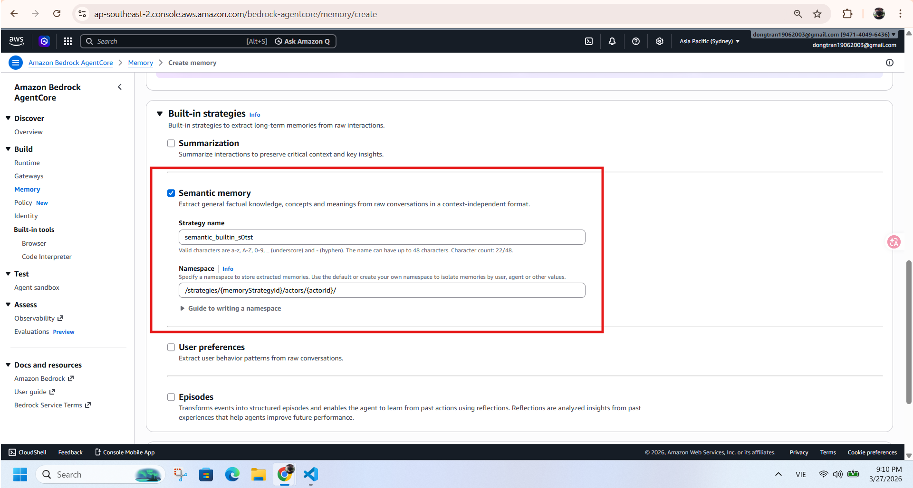
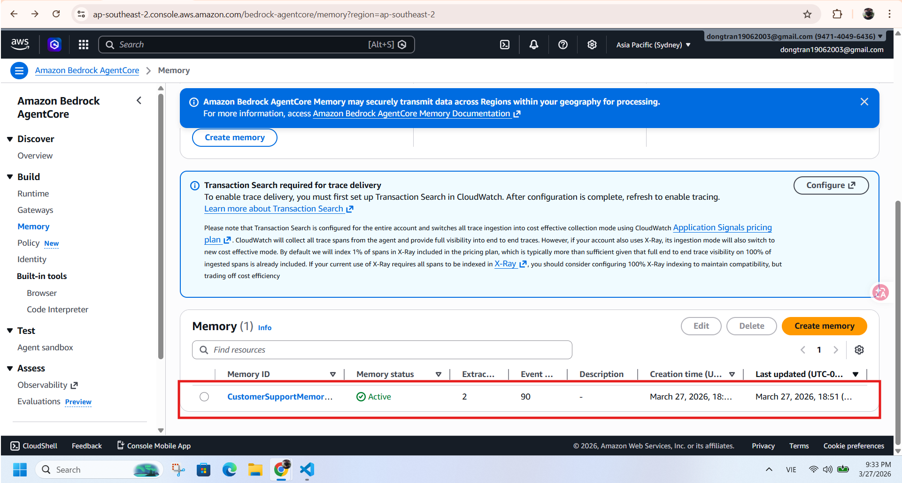

# Lab 2 - Add Memory to the Agent (English)

This guide walks you through Lab 2 of the AWS AgentCore workshop: adding long-term memory so the agent can remember customer context and provide personalized responses.

## 1. Reference Materials

- Workshop Lab 2: https://catalog.workshops.aws/workshops/850fcd5c-fd1f-48d7-932c-ad9babede979/en-US/30-add-memory
- Official sample notebook: https://github.com/awslabs/amazon-bedrock-agentcore-samples/blob/main/01-tutorials/09-AgentCore-E2E/strands-agents/lab-02-agentcore-memory.ipynb

## 2. Lab 2 Objectives

Starting from the Lab 1 agent (session-only behavior), this lab upgrades it so the agent can:

- Remember customer information across multiple conversations.
- Automatically extract user preferences (USER_PREFERENCE).
- Store and retrieve factual conversation context (SEMANTIC).
- Personalize responses when the customer comes back.

## 3. Create Memory Manually in AWS Console (No Code)

If you prefer creating Memory from the AWS Console instead of API calls in code, follow these steps:

1. Open Bedrock AgentCore Memory in AWS Console.
2. Create a new Memory resource, suggested name: `CustomerSupportMemory`.
3. Configure 2 strategies:
   - USER_PREFERENCE with namespace `support/customer/{actorId}/preferences/`
   - SEMANTIC with namespace `support/customer/{actorId}/semantic/`
4. Wait for provisioning to complete, then copy the Memory ID for later steps.

### Visual walkthrough

Create Memory in the console:



Configure memory settings and strategies:



Memory created successfully:



## 4. Local Environment Setup

Requirements:

- Python 3.10+
- AWS CLI configured (`aws configure`)
- AWS account with Bedrock AgentCore Memory permissions
- Default Bedrock model: `amazon.nova-lite-v1:0`

Install and run (PowerShell):

```powershell
cd lab2
python -m venv .venv
.\.venv\Scripts\Activate.ps1
pip install -r requirements.txt
python index.py
```

If you see `No module named 'dotenv'`, it usually means `.venv` is not activated correctly or dependencies are not installed.

## 5. Bedrock Model Configuration

The code first checks environment variable `BEDROCK_MODEL_ID`. If not set, it uses default `amazon.nova-lite-v1:0`.

Example:

```powershell
$env:BEDROCK_MODEL_ID="amazon.nova-lite-v1:0"
python index.py
```

## 6. Processing Flow in index.py

`index.py` follows the Lab 2 flow:

1. Load environment variables and detect current AWS region.
2. Create or reuse memory resource `CustomerSupportMemory`.
3. Configure 2 strategies (USER_PREFERENCE, SEMANTIC).
4. Seed sample conversation history via `create_event`.
5. Wait for asynchronous Long-Term Memory processing.
6. Retrieve memories from both namespaces.
7. Build Strands Agent with `AgentCoreMemorySessionManager`.
8. Run 2 personalization test prompts.

## 7. Common Output Explanation

If you see:

`Memory already exists. Using existing memory ID: ...`

that is expected. It means memory was created previously and is being reused.

If output shows `Your Memory ID is: None`, that indicates a wrong field was printed in older code. Current code already fixes this by printing `memory_id` correctly.

## 8. Quick Troubleshooting

1. `ModuleNotFoundError: No module named 'dotenv'`
- Reactivate `.venv`
- Run `pip install -r requirements.txt`

2. Region is `None`
- Set `AWS_REGION` or `AWS_DEFAULT_REGION`
- Or run `aws configure` again

3. Long-term memory not visible immediately
- Processing is async, wait 30-60 seconds
- Re-run script after memory service stabilizes

4. Access errors
- Check IAM permissions for Bedrock AgentCore Memory and Bedrock model access

## 9. Next Step

After Lab 2 is stable, continue to Lab 3 (Gateway + Identity) to integrate enterprise tools securely and expand capabilities.


